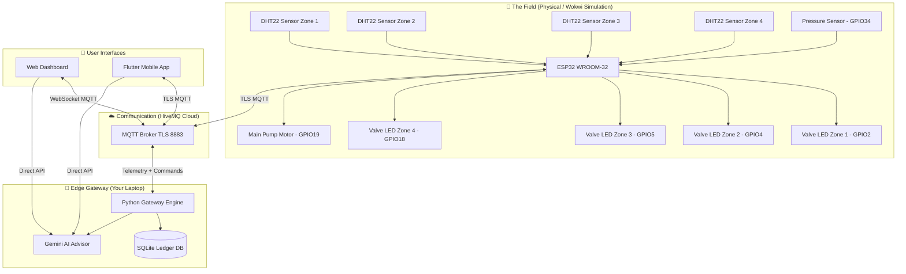
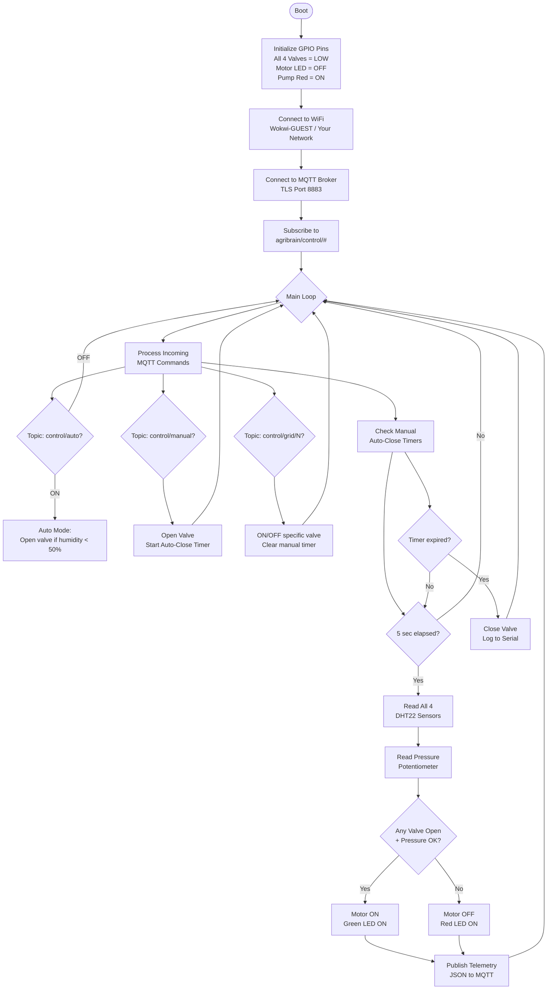

<div align="center">


# 🌾 Agri-Brain: AI-Orchestrated Rural Grid (A-ORG)

**An autonomous, offline-first smart irrigation system powered by ESP32 and Edge AI.**  
*Built for the AMD Slingshot 2026 Innovation Challenge by Shravan HS.*

[](LICENSE)
[](https://www.espressif.com/)
[](https://mqtt.org/)
[](https://wokwi.com/projects/456861684447098881)
[](https://ai.google.dev/)
[](https://flutter.dev/)

📊 **[View Pitch Deck](docs/AgriBrain_Submission_v2.pptx)** · 🎮 **[Live Wokwi Simulation](https://wokwi.com/projects/456861684447098881)** · 📖 **[Architecture Docs](docs/architecture/)**

</div>

---

## 📖 Table of Contents

<details>
<summary>Click to expand full Table of Contents</summary>

- [🌟 The Problem We Solve](#-the-problem-we-solve)
- [💡 Our Solution](#-our-solution)
- [🏗 System Architecture](#-system-architecture)
- [⚙️ Hardware Layer](#️-hardware-layer)
  - [Components Used](#components-used)
  - [Pin Mapping](#pin-mapping)
  - [Wiring Diagram](#wiring-diagram)
- [📟 Firmware Layer](#-firmware-layer)
  - [How to Set Up](#how-to-set-up-firmware)
  - [Firmware Logic Flow](#firmware-logic-flow)
  - [Key Safety Features](#key-safety-features)
- [🌐 Network Layer (MQTT)](#-network-layer-mqtt)
  - [Topic Architecture](#topic-architecture)
  - [How to Set Up HiveMQ](#how-to-set-up-hivemq)
- [🧠 Software & AI Layer](#-software--ai-layer)
  - [Python Edge Gateway](#python-edge-gateway)
  - [Web Dashboard](#web-dashboard)
  - [Flutter Mobile App](#flutter-mobile-app)
  - [Google Gemini AI Integration](#google-gemini-ai-integration)
- [🚀 Quick Start Guide](#-quick-start-guide)
- [📈 Roadmap](#-roadmap)
- [🤝 Contributing](#-contributing)

</details>

---

## 🌟 The Problem We Solve

Indian and rural farmers face three deeply interconnected crises that modern "smart farming" solutions consistently fail to address:

| # | Problem | Real Impact | Why Existing Solutions Fail |
|---|---------|-------------|----------------------------|
| 1 | 🚶 **The Kilometer Gap** | Farmers walk **5-10 km/day** just to manually open/close irrigation valves | IoT solutions require expensive motorized valves (₹10,000+ per valve) |
| 2 | 🔥 **Motor Burnout** | A pump running dry for **20 minutes** permanently destroys the motor (₹15,000–₹30,000 replacement cost) | Cloud-based systems have 5-minute delays; a brief internet drop = dead motor |
| 3 | ☁️ **The Cloud Gap** | Rural villages have **unreliable or no internet**. Cloud-dependent apps simply don't work | 90% of "Smart Agri" apps require stable 4G or broadband |

> [!IMPORTANT]
> Agri-Brain is specifically engineered to solve **all three** of these problems simultaneously with **zero cloud dependency** for core operations.

---

## 💡 Our Solution

Agri-Brain uses your **local laptop/PC as an intelligent Edge Gateway**. The ESP32 microcontroller in the field talks to this gateway over MQTT — a protocol so lightweight it works on 2G networks.

```
🌱 Soil Sensors → ESP32 Node → MQTT Broker → Edge Gateway (Laptop) → Gemini AI Advisor
                      ↑                              ↓
                   4 Grid LEDs ←─────────── Automated Commands
```

**No cloud needed for irrigation decisions. AI runs at the edge.**

---

## 🏗 System Architecture



---

## ⚙️ Hardware Layer

### Components Used

| Component | Quantity | Purpose | Cost (Approx.) |
|-----------|----------|---------|----------------|
| **ESP32 WROOM-32** | 1 | Main microcontroller / field hub | ₹350 |
| **DHT22 Sensor** | 4 | Temperature + Humidity per zone | ₹120 each |
| **Blue LED** | 4 | Simulate Solenoid Valves | ₹5 each |
| **Yellow LED** | 1 | Main Motor status | ₹5 |
| **Red LED** | 1 | Pump Dry-Run alarm | ₹5 |
| **Green LED** | 1 | Pump Safe indicator | ₹5 |
| **Potentiometer** | 1 | Simulate Water Pipe Pressure Sensor | ₹15 |
| **220Ω Resistors** | 7 | LED current limiting | ₹2 each |

> [!NOTE]
> In a production deployment, the LEDs would be replaced with **12V relay modules** driving real solenoid valves, and the DHT22 sensors would be replaced with **capacitive soil moisture probes** buried in the topsoil.

---

### Pin Mapping

```
┌─────────────────────────────────────────────────────────┐
│                     ESP32 WROOM-32                      │
│                                                         │
│  GPIO 32 ──────── DHT22 Zone 1 (DATA pin)              │
│  GPIO 13 ──────── DHT22 Zone 2 (DATA pin)              │
│  GPIO 25 ──────── DHT22 Zone 3 (DATA pin)              │
│  GPIO 26 ──────── DHT22 Zone 4 (DATA pin)              │
│                                                         │
│  GPIO  2 ──── 220Ω ──── Blue LED ──── GND  (Valve 1)  │
│  GPIO  4 ──── 220Ω ──── Blue LED ──── GND  (Valve 2)  │
│  GPIO  5 ──── 220Ω ──── Blue LED ──── GND  (Valve 3)  │
│  GPIO 18 ──── 220Ω ──── Blue LED ──── GND  (Valve 4)  │
│                                                         │
│  GPIO 19 ──── 220Ω ──── Yellow LED ─ GND  (Motor)     │
│  GPIO 21 ──── 220Ω ──── Red LED ──── GND  (Dry Alert) │
│  GPIO 22 ──── 220Ω ──── Green LED ── GND  (Pump OK)   │
│                                                         │
│  GPIO 34 ──────── Potentiometer Signal (Pressure)      │
│  3.3V ─────────── DHT22 VCC × 4 + Pot VCC             │
│  GND ──────────── All GND                              │
└─────────────────────────────────────────────────────────┘
```

---

### Wiring Diagram

> [!TIP]
> The complete Wokwi wiring is defined in [`firmware/diagram.json`](firmware/diagram.json). Open the [Live Simulation](https://wokwi.com/projects/456861684447098881) to see it in your browser — no hardware needed!

**DHT22 Wiring (per sensor):**
```
ESP32 3.3V  ──►  DHT22 Pin 1 (VCC)
ESP32 GPIOx ──►  DHT22 Pin 2 (DATA)
Not Used         DHT22 Pin 3
ESP32 GND   ──►  DHT22 Pin 4 (GND)
```

**LED/Valve Wiring (per LED):**
```
ESP32 GPIOx  ──►  220Ω Resistor  ──►  LED Anode (+)
                                       LED Cathode (-) ──► GND
```

---

## 📟 Firmware Layer

### How to Set Up Firmware

**Step 1: Install PlatformIO**
```bash
# Install VS Code, then install the PlatformIO extension
# https://platformio.org/install/ide?install=vscode
```

**Step 2: Configure Your MQTT Credentials**

Open `firmware/src/main.cpp` and replace the placeholders:
```cpp
// ─── CHANGE THESE ────────────────────────────────────────
const char *mqtt_server = "YOUR_HIVEMQ_CLUSTER.s1.eu.hivemq.cloud";
const char *mqtt_user   = "YOUR_MQTT_USERNAME";
const char *mqtt_pass   = "YOUR_MQTT_PASSWORD";
const char *topic_prefix = "agribrain";   // Your unique prefix
// ─────────────────────────────────────────────────────────
```

**Step 3: Flash or Simulate**
```bash
# To flash to real hardware:
pio run --target upload

# To simulate in Wokwi (no hardware needed):
# Just open https://wokwi.com and load firmware/diagram.json + firmware/src/main.cpp
```

---

### Firmware Logic Flow



---

### Key Safety Features

The ESP32 firmware has **two hardware-level safety systems** that work even if your internet goes down:

<details>
<summary><strong>🛡️ Safety Feature 1: Manual Valve Auto-Close Timer</strong></summary>

When a `control/manual` command opens a valve for N minutes, the ESP32 stores the exact millisecond deadline internally:

```cpp
// When command received:
manualValveEndMs[idx] = millis() + (unsigned long)duration * 60UL * 1000UL;

// In every loop() iteration:
if (manualValveEndMs[i] != 0 && millis() >= manualValveEndMs[i]) {
    digitalWrite(valvePins[i], LOW);   // Physically cut the water
    manualValveEndMs[i] = 0;           // Reset timer
    Serial.printf("[SAFETY] Valve %d auto-closed after timer\n", i+1);
}
```

**This means:** Even if your phone dies, your internet drops, or the Python gateway crashes — the valve will physically close at the scheduled time.

</details>

<details>
<summary><strong>🛡️ Safety Feature 2: Pressure-Based Dry-Run Motor Protection</strong></summary>

The firmware continuously reads the pressure sensor. If pressure drops below 20% of max (indicating an empty pipe or broken line), it immediately kills the motor regardless of any other commands:

```cpp
#define PRESSURE_DRY_THRESHOLD_PCT 20   // 20% of max PSI

bool applyPumpLogic(float psi) {
    float threshold = 0.20f * PRESSURE_MAX_PSI;  // = 20 PSI
    bool safe = (psi > threshold);
    digitalWrite(motorPin, safe ? HIGH : LOW);   // Cut motor instantly
    digitalWrite(pumpRedPin,   safe ? LOW : HIGH);
    digitalWrite(pumpGreenPin, safe ? HIGH : LOW);
    return safe;
}
```

**This means:** Even in AUTO mode with all 4 valves open, if the pipe runs dry, the motor shuts down in the **same firmware loop cycle** — under 5 milliseconds. No cloud round-trip. No delay.

</details>

---

## 🌐 Network Layer (MQTT)

### What is MQTT and Why We Use It

**MQTT (Message Queuing Telemetry Transport)** is a publish-subscribe messaging protocol originally designed for **oil pipeline sensors in areas with unreliable satellite internet**. It's the perfect protocol for farm IoT.

| Property | MQTT | HTTP (REST) |
|----------|------|------------|
| Overhead per message | ~2 bytes header | ~200+ bytes headers |
| Connection type | Persistent socket | New connection per request |
| Works on 2G/slow networks | ✅ Yes | ❌ Often too slow |
| Server push to device | ✅ Built-in | ❌ Requires polling |
| Bi-directional | ✅ Yes | ❌ Client-initiated only |

---

### Topic Architecture

All MQTT traffic uses a structured topic hierarchy. Think of topics like folder paths.

**Telemetry (Farm → Cloud → Interfaces):**
```
agribrain/telemetry/region/1    ← Zone 1 sensor data
agribrain/telemetry/region/2    ← Zone 2 sensor data
agribrain/telemetry/region/3    ← Zone 3 sensor data
agribrain/telemetry/region/4    ← Zone 4 sensor data
agribrain/telemetry/motor       ← Pump pressure + state
agribrain/system/heartbeat      ← Gateway alive ping (every 5s)
```

**Commands (Interfaces → Cloud → Farm):**
```
agribrain/control/auto          ← "ON" or "OFF" — toggle auto-irrigation
agribrain/control/grid/1        ← "ON" or "OFF" — direct valve control
agribrain/control/manual        ← {"region":1,"duration":10} — timed manual run
```

**AI & Ledger (Gateway → Interfaces):**
```
agribrain/ai/gemini/response    ← AI advisor reply text
agribrain/ledger/update         ← New farm activity entry
agribrain/voice_feedback        ← System status messages
```

**Sample Telemetry Payload:**
```json
{
  "region": 1,
  "humidity": 45.2,
  "temp": 30.1,
  "valve": false
}
```

**Sample Motor Payload:**
```json
{
  "state": "ON",
  "stage": "OK",
  "pressure_psi": 67
}
```

---

### How to Set Up HiveMQ

> [!TIP]
> HiveMQ Cloud has a **free tier** that supports up to 100 connected devices and is perfect for this project.

1. Go to [hivemq.com/mqtt-cloud-broker](https://www.hivemq.com/mqtt-cloud-broker/) and create a free account
2. Create a new **Serverless Cluster**
3. In **Access Management**, create a new credential (username + password)
4. Copy your **Cluster URL** (looks like `xxxxxxxx.s1.eu.hivemq.cloud`)
5. Update `firmware/src/main.cpp` with your cluster URL, username, and password
6. Update your gateway Python script with the same credentials

---

## 🧠 Software & AI Layer

### Python Edge Gateway

The Python gateway (`gateway/verify_mqtt.py`) is the central brain that:
- Subscribes to all telemetry from the ESP32
- Runs the **auto-irrigation engine** (queues grids when humidity < 50%)
- Manages the **sequential irrigation queue** (only one grid runs at a time to maintain pipe pressure)
- Logs all events to a local **SQLite database** (`gateway/farm_ledger.db`)
- Detects **motor anomalies** via the Acoustic AI module

**Install and run:**
```bash
pip install paho-mqtt
python gateway/verify_mqtt.py
```

---

### Web Dashboard

A zero-dependency, pure **HTML5 + CSS3 + Vanilla JavaScript** dashboard that:
- Connects directly to HiveMQ via **WebSocket (WSS port 8884)**
- Displays live telemetry from all 4 zones with animated soil bars
- Lets the farmer manually irrigate any zone with a timed duration
- Calls the **Google Gemini API directly** from the browser for AI advice

**Run locally:**
```bash
# From the web_app/ directory:
python -m http.server 8000
# Open http://localhost:8000
```

---

### Flutter Mobile App

A cross-platform mobile app built with Flutter + Dart that:
- Connects to HiveMQ via native TLS MQTT (`mqtt_client` package)
- Shows live zone data on the **Dashboard screen**
- Has a dedicated **AI Advisor screen** powered by Google Gemini 1.5 Flash
- Provides a **Farm Calendar** for scheduling and history

**Build APK:**
```bash
cd agri_brain_flutter
flutter pub get
flutter build apk --release
# APK at: build/app/outputs/flutter-apk/app-release.apk
```

---

### Google Gemini AI Integration

Both the Web Dashboard and Mobile App call the **Google Gemini 1.5 Flash API directly** — no Python gateway needed for AI. The key innovation is **live sensor context injection**: every AI query automatically includes the current farm state.

**How it works:**
```
User types: "Why is my crop looking yellow?"
         ↓
System builds prompt:
  "You are Agri-Gemini...
   CURRENT FARM LIVE DATA:
   Zone 1: humidity=28%, temp=34°C, valve=CLOSED  ← injected automatically!
   Zone 2: humidity=72%, temp=29°C, valve=OPEN
   ..."
         ↓
Gemini 1.5 Flash API responds with context-aware advice
         ↓
"Your Zone 1 humidity is critically low at 28% and temperature is high at 34°C.
 This is likely causing heat stress and nutrient lockout — both cause yellowing..."
```

**Get your free API key:** [aistudio.google.com/app/apikey](https://aistudio.google.com/app/apikey)

---

## 🚀 Quick Start Guide

> [!IMPORTANT]
> You can run this entire project **without any physical hardware** using the Wokwi browser simulator.

### Option A: Full Simulation (No Hardware)

```bash
# Step 1: Clone this repo
git clone https://github.com/ShravanaHS/Agri-Brain-AI-Orchestrated-Rural-Grid-A-ORG-.git
cd Agri-Brain-AI-Orchestrated-Rural-Grid-A-ORG-

# Step 2: Set up your credentials
# Edit firmware/src/main.cpp — add your HiveMQ details
# Edit gateway/verify_mqtt.py — add your HiveMQ details

# Step 3: Install Python dependencies
pip install paho-mqtt

# Step 4: Start the Edge Gateway
python gateway/verify_mqtt.py

# Step 5: Open the Wokwi simulation
# Go to: https://wokwi.com/projects/456861684447098881
# Click Play ▶

# Step 6: Open the Web Dashboard
cd web_app && python -m http.server 8000
# Open http://localhost:8000
```

### Option B: Physical Hardware

Same steps as above, but:
- Flash the firmware to your real ESP32 using PlatformIO
- Change `ssid` and `password` in `main.cpp` to your actual WiFi network
- Wire up DHT22 sensors and LEDs per the [Pin Mapping](#pin-mapping) table

---

## 📈 Roadmap

| Phase | Status | Description |
|-------|--------|-------------|
| **Phase 1** | ✅ Complete | Wokwi simulation + MQTT + Python auto-irrigation |
| **Phase 2** | ✅ Complete | 4-Zone sequential irrigation + hardware safety rules |
| **Phase 3** | ✅ Complete | Soil health AI + Acoustic motor protection |
| **Phase 4** | ✅ Complete | Web Dashboard + Flutter mobile app |
| **Phase 5** | ✅ Complete | Google Gemini AI direct integration |
| **Phase 6** | 🔄 Planned | Physical ESP32 deployment on real farm |
| **Phase 7** | 🔄 Planned | LoRaWAN long-range nodes (10km range) |
| **Phase 8** | 🔄 Planned | Solar-powered autonomous field nodes |

---

## 📁 Repository Structure

```
agri-brain/
├── firmware/               ← ESP32 C++ code (PlatformIO)
│   ├── src/
│   │   └── main.cpp        ← Main firmware (sensors + MQTT + safety)
│   ├── diagram.json        ← Wokwi simulation wiring
│   ├── platformio.ini      ← Build configuration
│   └── wokwi.toml          ← Wokwi project settings
│
├── docs/
│   └── architecture/       ← Detailed technical docs
│       ├── hardware.md     ← Hardware layer deep-dive
│       ├── firmware.md     ← Firmware layer deep-dive
│       ├── network.md      ← MQTT network layer deep-dive
│       └── software.md     ← Software layer deep-dive
│
└── README.md               ← This file
```

---

## 🤝 Contributing

Contributions, issues, and feature requests are welcome!

1. Fork the repository
2. Create your feature branch: `git checkout -b feature/my-feature`
3. Commit your changes: `git commit -m 'feat: add my feature'`
4. Push to the branch: `git push origin feature/my-feature`
5. Open a Pull Request

---

<div align="center">

**Built with ❤️ for Indian Farmers**

*Agri-Brain — AMD Slingshot 2026 Innovation Challenge*

**Shravan HS** · [GitHub](https://github.com/ShravanaHS)

</div>
