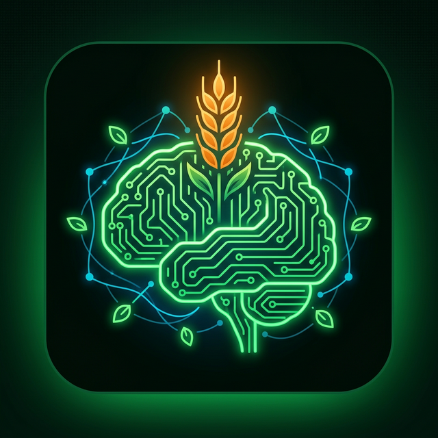
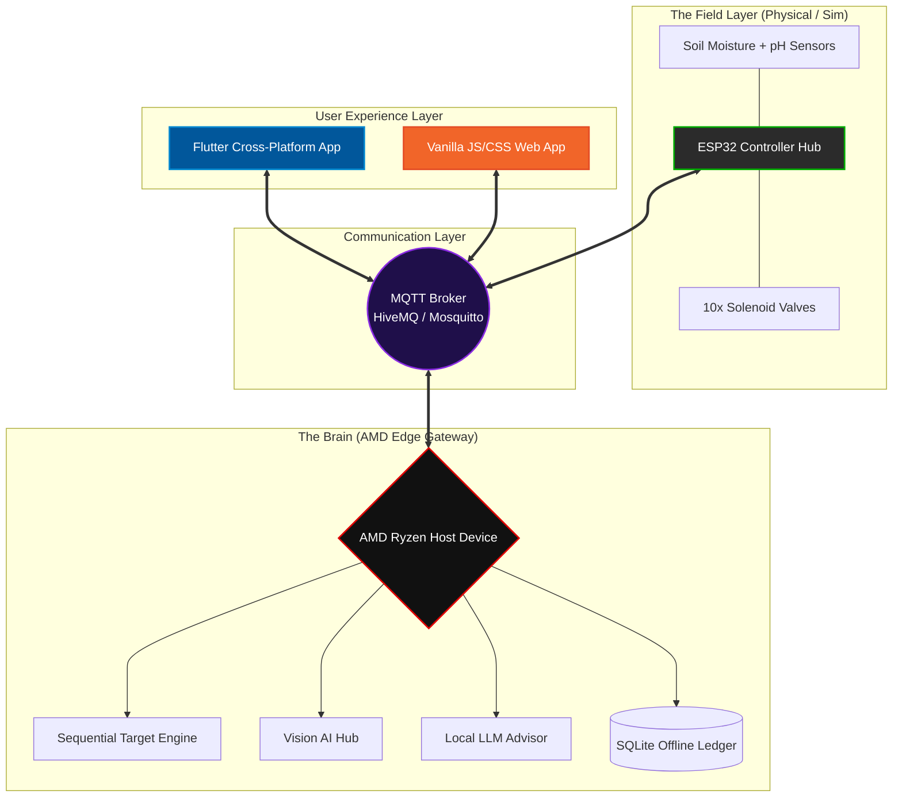

<div align="center">
  
  <h1>🌾 Agri-Brain: AI-Orchestrated Rural Grid (A-ORG)</h1>
  <p><em>Solving the "Kilometer Gap" and the "Cloud Gap" with Local Edge AI</em></p>

  [](#)
  [](#)
  [](#)
  [](#)
  [](#)
  [](#)
  [](#)

  <br />
  <h3>📊 <strong><a href="https://github.com/ShravanaHS/Agri-Brain-AI-Orchestrated-Rural-Grid-A-ORG-/blob/main/docs/AgriBrain_Submission.pptx">Download Presentation</a></strong></h3>
</div>

---

## 📖 Table of Contents
- [🌟 The Vision](#-the-vision)
- [👨‍🌾 The Problem](#-the-problem)
- [🚀 The Solution: "AMD Brain" Gateway](#-the-solution-amd-brain-gateway)
- [🧠 Farm Health AI (AMD-Powered)](#-farm-health-ai-amd-powered)
- [🌊 10-Grid Irrigation Strategy](#-the-10-grid-irrigation-strategy)
- [🏗️ Technical Architecture](#️-technical-architecture)
- [💻 Hardware & Software Stack](#-hardware--software-stack)
- [🛠️ Installation & Setup](#️-installation--setup)
- [📈 Roadmap](#-roadmap-to-production)
- [🤝 Core Team](#-core-team)

---

## 🌟 The Vision
Imagine a world where a farmer doesn't have to walk miles in the blistering Indian heat just to flip a single irrigation switch. Imagine a modern open-field farm that literally "listens" to its own motors and "watches" its own crops, making autonomous decisions in milliseconds to save water, prevent motor burnout, and drastically increase crop yield.

**Agri-Brain** is that vision brought to life. It’s not just a "smart farming dashboard"; it’s an **autonomous localized nervous system** for the modern Indian farm, engineered entirely around **AMD Ryzen™ High-Performance Edge AI computing**.

---

## 👨‍🌾 The Problem
Indian farmers (and rural farmers globally) face three massive, deeply interconnected challenges that existing "smart" solutions fail to address:

| Challenge | Real-World Impact | Why Existing Tech Fails |
| :--- | :--- | :--- |
| 🚶 **1. The "Kilometer Gap"** | Farmers walk 5-10km daily just to toggle heavy agricultural irrigation valves manually across large, multi-acre fields. | IoT solutions require expensive motorized valves that farmers can't afford. |
| 🔥 **2. Motor Burnouts** | If a mechanical pump runs dry for even 20 minutes, the motor burns out. Replacing a motor costs ₹15,000 to ₹30,000—often an entire month's profit margin. | Most cloud-based systems have a delay. A 5-minute internet drop means a dead motor. |
| ☁️ **3. The Cloud Gap** | Most "Smart Agri" edge solutions demand stable 4G connectivity or complicated physical Cloud setups. | In deep rural environments, the internet is at best a luxury, not a 24/7 guarantee. Cloud dependencies are fatal. |

---

## 🚀 The Solution: "AMD Brain" Gateway
Our philosophy is simple: **We brought the Cloud to the Farm.** 

**Agri-Brain** uses a standard, powerful local **Laptop (The Gateway)** acting as a highly capable, offline central brain. It speaks to low-cost **ESP32 microcontrollers (The Nodes)** deployed in the field using lightning-fast, ultra-low-latency MQTT communication.

### 🧠 How It Works In The Real World
1. 💧 **Sensory Input:** Nodes located in the topsoil read raw analog data (moisture, pH, NPK proxy values) and beam it over long-range Wi-Fi to the local AMD Laptop instance.
2. 🎧 **Acoustic Motor Guard:** The laptop continuously algorithms an acoustic microphone feed placed near the main water pump. If the pump sounds "dry" or "cavitating", the AI model identifies the anomaly instantly and kills the main relay, saving the hardware.
3. 👁️ **Vision AI Disease Hunting:** Farmers upload cell phone pictures of sickly crops via the local network dashboard. The laptop processes the image offline using advanced multi-modal models to identify exactly what blight or pest is attacking the field.
4. 🎙️ **NLP Voice Ledger:** A farmer holding a sack of fertilizer simply says, *"I just added 5 kilograms of Potash to Grid 4."* The laptop's local NLP engine transcribes this and automatically updates a lightweight SQLite database, eliminating manual record-keeping.

---

## 🧠 Farm Health AI (AMD-Powered)

#### 👁️ Vision AI: Real-Time Leaf Disease Detection
By leveraging the incredible multi-core processing power of **AMD Ryzen™ CPUs** combined with Edge APUs, the gateway processes high-res crop imagery locally. It can successfully identify:
- **Major Pathogens:** Early Blight and Late Blight (devastating to Tomatoes/Potatoes).
- **Insects:** Micro-pest infestations like the dreaded Leaf Miner and Spider Mites.
- **Malnourishment:** Visual nutrient deficiencies mathematically mapped from specific leaf discoloration and vein patterns.

#### 🌍 Localized Soil Health Mapping
Agri-Brain enables real-time, high-density analysis of pH, macronutrients, and moisture across all 10 segmented grids.
- **Grid-Specific Health Scores:** Unlike traditional farming where the "whole field" gets the same treatment, Agri-Brain knows exactly which part of the field is struggling.
- **Autonomous Actionable Insights:** Generates instant human-readable logic (e.g., *"Grid 4 is Highly Acidic: Suspend Irrigation and Add 10kg Lime"*).

#### 🗣️ Local LLM Offline Assistant
A lightweight, heavily quantized LLM model running entirely offline on the edge device serves as a 24/7 Agricultural Advisor. It can answer localized queries about crop rotation, optimal watering regimes, and hyper-local pest management without ever pinging the internet.

---

## 🌊 The 10-Grid Irrigation Strategy
Agri-Brain (A-ORG) replaces archaic, wasteful "pump-and-flood" irrigation with a hyper-efficient **Sequential Grid System**.

- ⚙️ **The Hardware Topology:** 1 Main Submersible Pump + 10 distinct Solenoid Valves, all autonomously managed by a single ESP32 relay hub.
- 💦 **Micro-Targeted Irrigation:** The system waters sequentially, section-by-section (e.g., it waters Grid 1 to 100%, turns off, then waters Grid 2 to 100%). This uniquely maintains maximum kinetic water pressure at every single nozzle and drip line, preventing sputtering in large fields.
- 🛡️ **Fail-Safe Firmware Integrity:** Built-in "Hard Timeout" logic physically coded into the ESP32 firmware ensures that even if the connection to the AMD Edge Gateway is totally severed, the hardware will physically close all valves after 2 hours to prevent catastrophic flooding.

---

## 🏗️ Technical Architecture
Agri-Brain is built from the ground up on a strict **Local-First** philosophy perfectly tailored for environments hostile to traditional tech.

<div align="center">



</div>

---

## 💻 Hardware & Software Stack

### Hardware Edge Architecture
- **Core Edge processing node**: AMD Ryzen™ Powered Laptop/Mini PC
- **Field Networking & Control Hub**: ESP32 WROOM / Arduino ecosystem
- **Actuators**: 12V DC Solenoid Valves (Simulated in Phase 1)
- **Sensory Intake**: Generic analog soil moisture & pH resistors

### Software / Languages Stack
- **AI Gateway & MQTT Watcher Engine**: `Python 3.1x` + `paho-mqtt`
- **Embedded C++**: `PlatformIO` + `Arduino.h` (Wokwi Framework)
- **Mobile Native Application**: `Flutter` / `Dart`
- **Web Interface Dashboard**: `HTML5`, `Vanilla CSS`, `Vanilla JS`
- **Relational Database**: `SQLite3` (Embedded local ledger)

---

## 🛠️ Installation & Setup

Want to run Agri-Brain locally? Here's how to spin up the entire ecosystem in under 5 minutes.

### Step 1: Initialize The Virtual Farm Simulation (Wokwi)
1. Open up `firmware/diagram.json` and `firmware/src/main.cpp`.
2. Load both configurations into the highly accurate [Wokwi.com Simulator](https://wokwi.com).
3. Press **Play**. 
*You now have a complete, mathematically accurate virtual farm actively transmitting telemetry payloads.*

### Step 2: Boot The Python AI Brain (Edge Gateway)
1. Ensure your local Python environment has the MQTT library installed:
```powershell
pip install paho-mqtt
```
2. In a terminal, cd into the repo and wake up the Master Brain Watcher:
```powershell
python gateway/verify_mqtt.py
```
> **Pro Tip:** *Once running, move the physical analog moisture slider in the Wokwi UI slowly down to 0% and watch the Python AI instantly intercept the drop and trigger `AUTO-COMMAND` packets in your terminal to turn ON the localized grids!*

### Step 3: Serve the Web App Dashboard
To view the UI frontend controlling the logic:
1. Open the `/web_app` directory.
2. Launch a simple quick server (or use VS Code Live Server extension):
```powershell
python -m http.server 8000
```
3. Navigate to `http://localhost:8000` to see the live data syncing.

---

## 📈 Simulation Results (Phase 1)

### 🌐 [Click Here to View the LIVE Wokwi Simulation Online](https://wokwi.com/projects/457101570943087617)

---

## 📈 Roadmap to Production
We built this iteratively through massive milestones:
- ✅ **Day 1:** Phase 1 (Wokwi + Public Broker Integration)
- ✅ **Day 2:** Complex 10-Grid Irrigation Sequential Logic & Assured Hardware Safety Rules
- ✅ **Day 3:** Orchestrating Farm Health AI models (Vision processing & Soil Mapping analytics)
- ✅ **Day 4:** Premium modern web/Flutter dashboard built from scratch with Grid Mapping UI
- ✅ **Day 5:** Final hardware-software mesh Integration & Pitch Deck Finalization

---

##  Core Team
<div align="center">
  <h3>Shravana H S</h3>
    <h3>Antigraity</h3>
    <h3>Chat GPT</h3>
</div>
