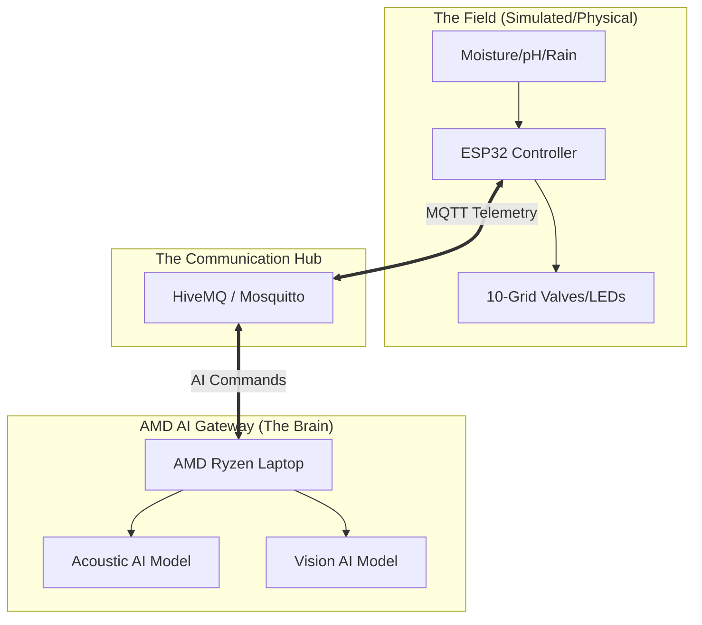
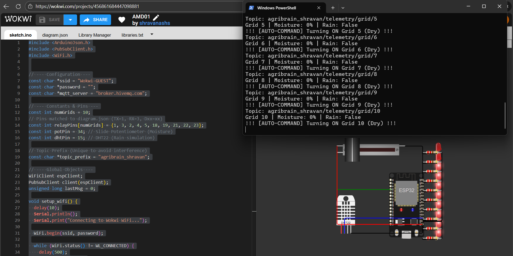

# 🌾 Agri-Brain: AI-Orchestrated Rural Grid (A-ORG)
### *Solving the "Kilometer Gap" with Edge AI*

---

## 🌟 The Vision
Imagine a world where a farmer doesn't have to walk miles in the heat just to flip a switch. Imagine a farm that "listens" to its own motors and "watches" its own crops, making decisions in milliseconds to save water and prevent equipment damage.

**Agri-Brain** is that vision. It’s not just a "smart" tool; it’s an autonomous nervous system for the modern farm, powered by **AMD Ryzen™** and **Edge AI**.

---

## 👨‍🌾 The Problem: Why this matters
Indian farmers (like my father) face three massive challenges:
1.  **The "Kilometer Gap":** Farmers walk 5-10km daily just to toggle irrigation valves.
2.  **Motor Burnouts:** If a pump runs dry, the motor burns out. This costs a farmer their entire month's profit.
3.  **The Cloud Gap:** Most "Smart Agri" apps need 4G/Cloud. In our villages, the internet is a luxury, not a guarantee.

---

## 🚀 The Solution: "AMD Brain" Gateway
We don't need the Cloud. We brought the processing power to the farm.
Agri-Brain uses a local **AMD Ryzen Laptop** as an **Edge Gateway**. It talks to **ESP32 controllers** in the field using MQTT.

### 🧠 How it works (Simple Version):
1.  **Sensors** in the soil send moisture/pH data to the AMD Laptop.
2.  **Acoustic AI** (on AMD) listens to the pump motor. If it sounds "wrong," the laptop tells the pump to shut down instantly.
3.  **Vision AI** (on AMD) watches the plants for disease.
4.  **Voice Ledger:** The farmer just says *"Added 5kg Potash"* in Kannada/Hindi, and the laptop records it—no typing needed.

---

## 🏗️ Technical Architecture
Agri-Brain is built on a **Local-First** philosophy.

-   **Field Layer:** ESP32 Microcontrollers managing 10 irrigation grids.
-   **Nervous System:** MQTT Protocol for hyper-fast, low-latency communication.
-   **Intelligence Layer (The Brain):** AMD Ryzen processing Multi-Modal AI (Audio + Video + NLP).
-   **User UI:** A Flutter Mobile App for manual control and digital mapping.



---

## ✅ Phase 1: The "Success" Milestone
We have successfully built a **Zero-Budget Prototype** using:
-   **Wokwi:** To simulate a 10-grid ESP32 hardware system.
-   **HiveMQ:** As a global public bridge.
-   **Python:** As our first-stage "Decision Engine."

**Current Status:** Moving the virtual moisture slider in Wokwi successfully triggers the Python AI Brain to turn on/off the 10 virtual irrigation valves!

---

## � Simulation Results (Phase 1)

*Above: Wokwi ESP32 simulation reporting 0% moisture, triggering the Python AI Watcher to send AUTO-COMMANDS to turn ON all 10 grids.*

---

## �🛠️ Quick Start (Try it in 2 minutes!)

### 1. The Virtual Farm (Wokwi)
- Open `firmware/diagram.json` and `firmware/src/main.cpp`.
- Load them into [Wokwi](https://wokwi.com).
- Press **Play**.

### 2. The AI Brain (Python)
Ensure you have `paho-mqtt` installed:
```powershell
py -m pip install paho-mqtt
```
Run the watcher:
```powershell
py gateway/verify_mqtt.py
```
*Move the slider in Wokwi and watch the "AI" trigger commands in your terminal!*

---

## 📈 Roadmap to Production
- [x] **Day 1:** Phase 1 (Wokwi + Public Broker) - **DONE**
- [ ] **Day 2:** Acoustic AI Model (Detecting Motor cavitation).
- [ ] **Day 3:** Local NLP Voice Ledger (Vosk integration).
- [ ] **Day 4:** Flutter App UI (The "Cult.fit" for Farmers).
- [ ] **Day 5:** Final Integration & Pitch Prep.

---

## 🤝 Project by Shravan HS
*Built for AMD Slingshot 2026 Innovation Challenge*

> "Engineering is not just about code; it's about solving the struggles I saw in my father's eyes."
