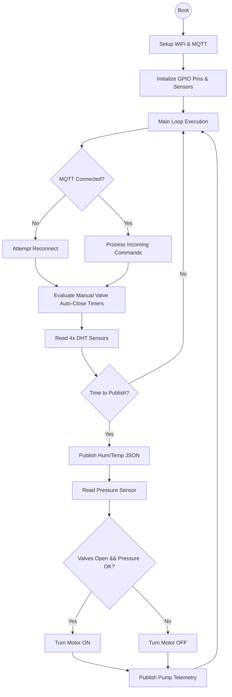

# Firmware Layer Architecture

This document covers the low-level embedded software running on the **ESP32 Microcontroller**. The firmware is responsible for reading hardware sensors, executing hardware-level safety rules, and maintaining the communication loop.

## 1. Code Overview and Setup
The firmware is written in C++ using the Arduino framework via PlatformIO. 
It relies on three major libraries:
*   **`DHT.h`**: To interface with the 4 DHT22 sensors.
*   **`PubSubClient.h`**: To handle the MQTT publish/subscribe lifecycle.
*   **`ArduinoJson.h`**: To parse incoming commands and format outgoing telemetry into lightweight JSON payloads.

---

## 2. Firmware Execution Flow (Flow Chart)



---

## 3. Core Logic Blocks

### A. The Auto-Close Safety Timer
To prevent accidental flooding if the web-app sends an "OPEN" command and then loses internet, the ESP32 handles a "hard timeout" natively.
```cpp
// When an OPEN command is received
int duration = doc["duration"] | 1; // minutes
manualValveEndMs[idx] = millis() + (unsigned long)duration * 60UL * 1000UL;

// Inside the Main Loop
if (manualValveEndMs[i] != 0 && millis() >= manualValveEndMs[i]) {
    digitalWrite(valvePins[i], LOW); // Physically cut the water
    manualValveEndMs[i] = 0;         // Reset timer
}
```

### B. Dry-Run Pump Protection
The firmware constantly monitors an analog pressure pin. If the pressure drops below `20%` (indicating a dry pipe or cavitation), the firmware forcefully kills the motor pin, regardless of what the user or gateway commands.

```cpp
float readPressurePSI() {
  int raw = analogRead(pressurePin); // 0–4095
  return (raw / 4095.0f) * PRESSURE_MAX_PSI;
}

bool applyPumpLogic(float psi) {
  float threshold = 0.20f * PRESSURE_MAX_PSI; // 20%
  bool good = (psi > threshold);
  digitalWrite(motorPin, good ? HIGH : LOW);
  return good;
}
```

### C. The Telemetry Payload
Every 5 seconds, the ESP32 loops over the 4 regions, packages the data into a JSON document, and pushes it over MQTT.

```json
{
  "region": 1,
  "humidity": 45.2,
  "temp": 30.1,
  "valve": false
}
```

---

## 4. Firmware Flow Screenshot

*(Insert Firmware Code Snippet / VSCode Screenshot Here)*
> **Screenshot details:** Show the PlatformIO environment or the specific `applyPumpLogic` function running safely in the Wokwi terminal.
