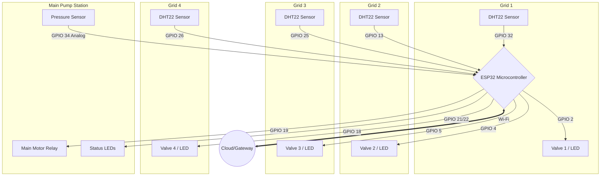

# Hardware Layer Architecture

This document explains the foundation of the Agri-Brain system: the physical sensors, microcontrollers, and actuators that interface directly with the farm.

## 1. System Overview (4-Grid Configuration)
For our initial prototype, we have modeled a **4-region agricultural grid**. Each region operates independently and contains its own sensors and actuators. The entire system is governed by a single **ESP32 Microcontroller**.

### Components Used:
*   **Microcontroller**: 1x ESP32 (WROOM-32 module). Acts as the field-hub.
*   **Sensors**: 4x DHT22 Temperature & Humidity Sensors (one for each grid).
*   **Actuators (Simulation)**: 4x LEDs representing Solenoid Valves.
*   **Pump & Safety**: 1x LED representing the Main Water Pump, accompanied by Red/Green status LEDs and an Analog Potentiometer simulating a pressure sensor.

---

## 2. Pin Mapping & Wiring

Here is the exact GPIO pin mapping used for connecting the hardware to the ESP32:

| Component | ESP32 GPIO Pin | Function |
| :--- | :--- | :--- |
| **Grid 1 DHT22** | `GPIO 32` | Reads Temp & Humidity for Region 1 |
| **Grid 2 DHT22** | `GPIO 13` | Reads Temp & Humidity for Region 2 |
| **Grid 3 DHT22** | `GPIO 25` | Reads Temp & Humidity for Region 3 |
| **Grid 4 DHT22** | `GPIO 26` | Reads Temp & Humidity for Region 4 |
| **Grid 1 Valve (LED)** | `GPIO 2` | Digital Out to open/close water to Region 1 |
| **Grid 2 Valve (LED)** | `GPIO 4` | Digital Out to open/close water to Region 2 |
| **Grid 3 Valve (LED)** | `GPIO 5` | Digital Out to open/close water to Region 3 |
| **Grid 4 Valve (LED)** | `GPIO 18` | Digital Out to open/close water to Region 4 |
| **Main Motor (LED)** | `GPIO 19` | Digital Out to trigger main water pump |
| **Motor Red LED** | `GPIO 21` | Visual indicator: Pump Error / Dry Run |
| **Motor Green LED**| `GPIO 22` | Visual indicator: Pump Running Safely |
| **Pressure Sensor**| `GPIO 34` | Analog In (0-4095) for water line pressure |

---

## 3. Hardware Block Diagram

---

## 4. Hardware Simulation Screenshot

*(Insert Wokwi Simulation Screenshot Here)*
> **Screenshot details:** Show the ESP32 wired to the 4 DHT sensors, the 4 Valve LEDs, and the potentiometer representing the pressure gauge.

---

## 5. Future Hardware Upgrades
While the current 4-grid simulation proves the concept, transitioning to a production environment requires the following physical upgrades:

1.  **Industrial Soil Probes**: Replace DHT22 (air sensors) with capacitive RS485/Modbus Soil Moisture and NPK sensors for accurate ground data.
2.  **Relay Modules**: Replace LEDs with Opto-isolated 12V/24V Relay modules capable of safely switching industrial solenoid valves.
3.  **Physical Flow Meters**: Add Hall-effect flow sensors in the pipes to measure exact liters consumed per grid, improving the motor safety logic.
4.  **LoRaWAN Integration**: In deep rural areas, ESP32 Wi-Fi range is insufficient. Upgrading the nodes to use LoRa (e.g., SX1276) will allow up to 10km of wireless communication back to the central gateway.
