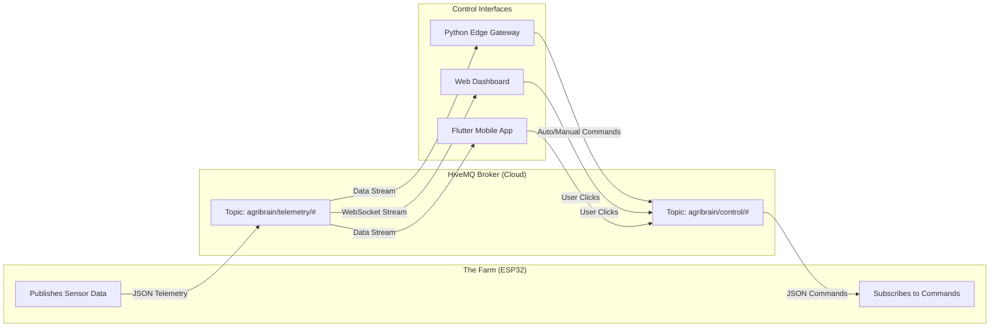

# Network Layer Architecture

This document breaks down how the Hardware, the Gateway, and the User Interfaces communicate with each other globally without complicated firewall configurations.

## 1. The Protocol: MQTT
We chose **MQTT (Message Queuing Telemetry Transport)** over HTTP because:
*   **Extremely Lightweight:** Designed for low-bandwidth, high-latency networks (perfect for rural farms).
*   **Bi-Directional:** Unlike HTTP requests, the ESP32 maintains an open socket, allowing us to push a valve "ON" command instantly.
*   **Pub/Sub Model:** The ESP32 doesn't need to know the IP address of the Flutter app; it only needs to know the Broker's address.

## 2. The Broker: HiveMQ Public Cloud
For this iteration, we use the public HiveMQ broker (`broker.hivemq.com` or HiveMQ Cloud). 
*   The **ESP32** connects to it via its local Wi-Fi.
*   The **Python Gateway** connects to it via the laptop's internet.
*   The **Web/Flutter Apps** connect to it via WebSockets.

---

## 3. Network Block Diagram

---

## 4. Topic Architecture (From Scratch)

We created a hierarchical topic structure to keep data organized.

### Telemetry (Data flowing UP from Farm to Apps)
*   `agribrain_shravan/telemetry/region/1` : Contains JSON regarding Grid 1's moisture and valve state.
*   `agribrain_shravan/telemetry/region/2` : Contains JSON regarding Grid 2.
*   `agribrain_shravan/telemetry/motor` : Contains pump pressure and safety status.

### Control (Commands flowing DOWN from Apps to Farm)
*   `agribrain_shravan/control/auto` : Payload `ON` or `OFF`. Tells the ESP32 to let the Python gateway manage watering automatically.
*   `agribrain_shravan/control/grid/1` : Payload `ON` or `OFF`. Forces Grid 1 valve to open.
*   `agribrain_shravan/control/manual` : Payload `{"region": 1, "duration": 5}`. Sets a scheduled manual run for 5 minutes.

---

## 5. Network Traffic Screenshot

*(Insert MQTT Explorer / HiveMQ Dashboard Screenshot Here)*
> **Screenshot details:** Show the HiveMQ Web Client or MQTT Explorer software displaying the live JSON payloads coming in on the `agribrain_shravan/telemetry/#` topics.
